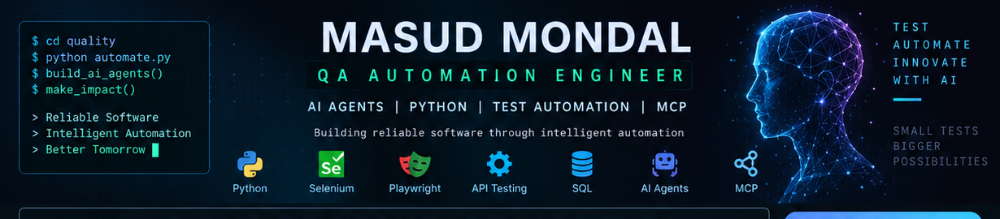

<div align="center">




</div>

---

## 👋 About Me

I'm **Masud Mondal**, a QA Automation Engineer and Technical Author focused on building reliable, maintainable and practical automation solutions.

My current engineering direction combines:

**QA Automation → Python → AI/LLMs → MCP → AI Agents → Intelligent Automation**

I enjoy turning technical concepts into practical projects, reusable frameworks and implementation-focused learning resources.

---

## 🧪 QA Automation

- 🐍 Python
- ☕ Java
- 🧪 Selenium WebDriver
- 🎭 Playwright
- 🧫 PyTest
- 🔌 REST API Testing
- 🗄️ SQL
- 🔄 CI/CD
- 🔧 Git & GitHub

My goal is not just to automate test cases, but to build automation that is **reliable, maintainable and production-oriented**.

---

## 🤖 AI Agent Engineering

I'm exploring practical AI-agent systems that connect LLM reasoning with tools, external systems and automation workflows.

```text
                    ┌──────────────┐
                    │     LLM      │
                    └──────┬───────┘
                           │
                    ┌──────▼───────┐
                    │   AI AGENT   │
                    └──────┬───────┘
                           │
          ┌────────────────┼────────────────┐
          │                │                │
      ┌───▼───┐        ┌───▼───┐       ┌───▼───┐
      │ Tools │        │  MCP  │       │Memory │
      └───┬───┘        └───┬───┘       └───┬───┘
          │                │                │
          └────────────────┼────────────────┘
                           │
                    ┌──────▼───────┐
                    │  Automation  │
                    └──────────────┘
```

### Current interests

`AI Agents` · `LLMs` · `Tool Calling` · `MCP` · `RAG` · `Agent Workflows` · `AI Testing` · `Intelligent Automation`

---

# 🚀 Featured Projects

| Project | Focus |
|---|---|
| 🤖 **Production-Ready AI Agent** | Production-oriented AI agent architecture |
| 🤖 **AI Agents with Python** | Practical Python agent patterns |
| 🔌 **Building MCP Servers with Python** | MCP servers and tool integration |
| 🧪 **GlobalShop QA** | Practical QA automation |
| 🔌 **MCP for Developers** | MCP concepts and implementation |
| 🗄️ **Advanced Data Engineering Projects** | Real-world data engineering |

---

## 🧰 Technology Stack

<div align="center">


<br/><br/>


</div>

---

## 📊 GitHub Activity

<div align="center">


</div>

---

## 🐍 Contribution Activity

<div align="center">

<picture>
  <source media="(prefers-color-scheme: dark)" srcset="https://raw.githubusercontent.com/masud-dot/masud-dot/output/github-snake-dark.svg">
  <source media="(prefers-color-scheme: light)" srcset="https://raw.githubusercontent.com/masud-dot/masud-dot/output/github-snake.svg">
  
</picture>

</div>

---

## 📚 Technical Author

I write practical technology books focused on real-world engineering and implementation.

**Topics include:**

`Software Testing` · `Automation` · `Python` · `Data Engineering` · `APIs` · `AI` · `AI Agents` · `MCP`

> **Learn the concept → Build the project → Understand the engineering behind it.**

---

## 🎯 Current Focus

```text
🧪 Advanced Test Automation
        ↓
🐍 Python Engineering
        ↓
🤖 AI-Assisted Testing
        ↓
🧠 LLM Applications
        ↓
🔌 MCP & Tool Integration
        ↓
🤖 AI Agents
        ↓
🚀 Intelligent Automation
```

---

## 📫 Connect

<div align="center">

<a href="https://github.com/masud-dot">
  
</a>

</div>

---

<div align="center">

### 💡 Build • Automate • Test • Learn • Share


</div>
